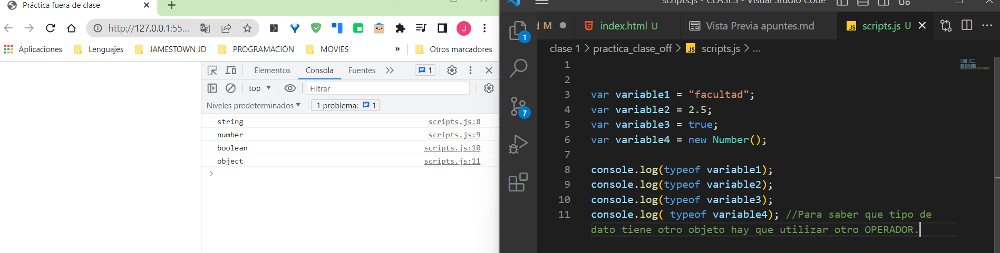

Proyecto: Se puede hacer variedad de cosas, algo que no estusiasme. Tener en cuenta que el proyecto es una simulación. Ecomerce, conversor, videojuegos, adivinar personaje....

 
 Las pre enregas tienen hasta 7 dias a partir de esas clase. Proyecto final 10 días. 

 Tambien se puede utilizar un framework para hacer la parte de css más rapido. 


 # Codigo JS

```html
 <script>

// aqui codigo, esta forma no es reomendada// 

</script>
```

La forma recomenda es hacer otro archivo y pegar al final del codigo html:

```html
<script src="codigo.js"></script>
</body>
</html>
```

# Formas de comentar 

```javascript
//Comentario de una sola linea

/* Este es un comentario 
multilinea
*/
```

# Variables

Que reserve espacio en la memoria ram para un dato.
Algo que es variable es porque puede cambiar con el tiempo. Nueva información, ira variando. 

No utilizar palabras con ñ, tildes... 
Si son dos palabras, asi: anioNacimiento

Palabras reservadas


# Declaración de una variable
Declarar una variable significa crearla. Hay tres tipos de declaraciones en JavaScript 

`var` : Declara una variable, inicianizandola opcionalmente a un valor. Podra cambiar su valor y su scope es local. 

`let` : Declara una variable local en un bloque de ámbito, inicianizandola opcionalmente a un valor. Podra cambiar su valor. 

`const`: Declara una variable de sólo lectura en un bloque de ámbito. No será posible cambiar su valor, mediante la asignación. 

Ejemplo:

```javascript
let nombre;
```

# Ámbito de una variable
1. **Variable global:** Cuando declaras una variable fuera de una función. Esta disponible para cualquier otro codigo en e documento actual. 

2. **Variable local:** Cuando declaras una variable dentro de una función. Esta disponible solo dentro de esa función donde fue creada. 


# contantes
Siempre seran el valor asignado

Let puede recibir diferentes asignaciones. En cambio const recibe una UNICA asignación. Ejemplo:

```javascript
// constantes
const america = 1492;
const pi = 3.1416;
```

# Asignación
Es decir, asignarle a una variable un dato mediante el operador de asignación que es: =

```javascript
// 1. declaración de la variable
let nombre;
// 2. asignacion de datos
nombre = "Pepe"; //dato de tiempo string o cadena de texto
```
También se puede hacer en la misma linea:
```javascript
// declaraxcion y asignacion en la misma linea
let apellido = "Gomez";
```
# Tipos de datos

- **String:** Secuencia de cáracteres que representa un valor. Ej: "Hola"

- **Number:** Valor numérico (entero,decimal...) Ej: 555

- **Bolean:** Valores *true* o *false*

- ***Null:** Denota valor nulo. null no es lo mismo que Null, NULL

- **Undefined:** Valor sin definir

- **Symbol:** Tipo de dato cuyos casos son únicos e inmutables.

- **Object:** Objecto. {} Puede contener más variables en su interior. 

# Typeof

Es utilizada para saber el tipo de dato que tiene una variable. Ej:



# Operaciones matematicas 

```javascript
// Operaciones matematicas
let nota1 = 10;
let nota2 = 6;
let sumaNotas = nota1 + nota2; // =16

let restNotas = nota1 - nota2; // =4

let multipNotas = nota1 * nota2; // =60

let divideNotas = nota1 / nota2; // =1.66
```
# Concatenación
Concatenar es combinar
```javascript
let nombre = "Juan";
let apellido = "Arcila";

let nombreCompleto = nombre + " " + apellido; //Juan Arcila
```
Tambien se puede hacer de la siguiente manera:
```javascript
let nombre = "Juan";
let apellido = "Arcila";
const BLANCO = " ";

let nombreCompleto = nombre + BLANCO + apellido; //Juan Arcila
```

# ¿Como se hace la salida de datos?

## 1. Por la consola

Recodar que ya se debe tener una una declaración y asignación de las variables:

```javascript
let nota1 = 10;
let nota2 = 6;
let sumaNotas = nota1 + nota2; // =16

let restNotas = nota1 - nota2; // =4

let multipNotas = nota1 * nota2; // =60

let divideNotas = nota1 / nota2; // =1.66
```
Salida de datos por la consola:

```javascript
console.log( "La suma de las notas es: " + sumaNotas);
console.log( "La resta de las notas es: " + restNotas);
console.log( "La multiplicacion de las notas es: " + multipNotas);
console.log( "La división de las notas es: " + divideNotas);
```
Se ejecuta en la consola del navegador, asi podemos corroborar que el codigo esta correcto, solo nos sirve a nosotros como desarrolladores. 

## Por un alert
Para mostrarselo al usuario. Mandarlo un mensaje al usuario. 

```javascript
let nota1 = 10;
let nota2 = 6;
let sumaNotas = nota1 + nota2; // =16

let restNotas = nota1 - nota2; // =4

let multipNotas = nota1 * nota2; // =60

let divideNotas = nota1 / nota2; // =1.66
```
Solo es cambiar el console.log por alert:

```javascript
alert( "La suma de las notas es: " + sumaNotas);
```
Apareceria asi:


# PROMPT - Ingreso de datos del usuario
Para que el usuario ingrese un dato. 

ejemplo: 

```javascript
let nombreIngresado = prompt("Ingrese su nombre");
```


**NOTA IMPORTANTE:** Prompt toma los datos en formato strinmg (texto).

Es decir que para poder convertir a un número entero se utliza ( en dado caso que se quiera operar matematicamente con el): **parseInt**

ej: 
```javascript
//ingreso de datos del usuario
let anioActual = parseInt(prompt("ingrese el año actual"));

// operación matematica
let desdeDescubrimientoAmercia = anioActual - america;

//mostarlo al usuario
alert("Hace "+desdeDescubrimientoAmercia+" años que se descubrio America");
```

Cuando es numero decimal, se realiza con: **parseFloat**

ej:

```javascript
//ingreso de datos del usuario
let precio = parseFloat(prompt("Ingrese el precio del producto"));

//operación matematica
let precioConIva = precio * 1.21;

//Mostrarlo al usuario
alert("El precio final con Iva es $"+precioConIva);
```


# MATERIAL AMPLIADO

Consola, variables y tipos de datos | 
 Los apuntes de Majo (Página 1 a 8).
 https://drive.google.com/file/d/11Qd_2a9YfHq7Yt4IGLXwWRs6OFpSu-6o/view


Variables, valores y referencias | 
Te lo explico con gatitos.
https://teloexplicocongatitos.com/poster/tlecg08

Práctica interactiva sobre Algoritmia | 
La aventura del punto.
https://little-dot.toxicode.fr/?hour-of-code