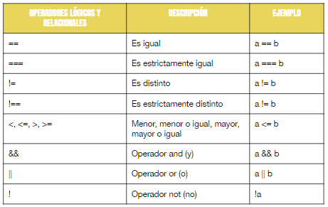

# Condicionales

Tomar una decisión a partir de una condición. La condición siempre termina siendo evaluado con un valor verdadero. Si <condición> entonces <operación>

# Control de flujos

A partir de una evaluación nuestro programa puede tomar varios caminos posibles de acción. 

## Valores Booleanos

Los cuales toman dos valores, true o false. Para que nuestro programa tome un camino u otro le vamos a decir que resuelva alguna evaluación/comparación. Ejemplo:

```javascript
let numero   = 10;
let esMayor5 = (numero > 5); // su valor sera true

if (esValida) {
    alert("Es boolean true");
}
```
# Estructura IF

```javascript
// si - condicion
if (true) {
	// bloque de código a ejecutar
    console.log("vas a ver este mensaje");
}

```

# Comparación

Cuando comparamos dos valores a través de un operador de comparación, ésta operación siempre se resuelve en true o false, es decir la comparación es verdadera o falsa. "=="

## Ejemplo condicionales

let unNumero = 5

```javascript
// Con (unNumero == 5) comparamos si unNumero es igual a 5
if (unNumero == 5){
    console.log("vas a ver este mensaje");
}

// Con (unNumero == 6) comparamos si unNumero es igual a 6
if (unNumero == 6){ 
    console.log("no vas a ver este mensaje");
}
```
En el primer condicional, como los dos valores coinciden, la igualdad se cumple, y por lo tanto la condición es cierta; su valor es true, y se ejecutan las instrucciones contenidas en el bloque del if.

En el segundo caso unNumero no es igual a 6; su valor es false, y no se ejecutan las instrucciones contenidas en el bloque del if.

# If else
Normalmente las condiciones suelen ser del tipo "Si se cumple la condición, hazlo; si no se cumple, haz esto otro."

```javascript
let unColor = "Rojo"

// Con (unColor == "Rojo") comparamos si unColor es igual "Rojo"
if (unColor == "Rojo"){
    console.log("el color es Rojo");
}else{
//La instrucción se interpreta cuando unColor NO es "Rojo"
    console.log("el color NO es Rojo");
}
```
```javascript
let nombreUsuario = prompt("Ingresar nombre de usuario");

if (nombreUsuario == "") {
    alert("No ingresaste el nombre de usuario");
}
else {
    alert("Nombre de usuario ingresado " + nombreUsuario);
}
```

## Condiciones anidadas if… else if
Un condicional dentro de otro condicional. 

```javascript
let precio = 100.5;

if (precio < 20) {
    alert("El precio es menor que 20");
}
else if (precio < 50) {
    alert("El precio es menor que 50");
}
else if (precio < 100) {
    alert("El precio es menor que 100");
}
else {
    alert("El precio es mayor que 100");
}
```

# Operadores logicos
como son: es igual, es distinto, menor, menor o igual, mayor, mayor o igual, and (y), or (o) y not (no). La sintaxis se basa en símbolos, como veremos a continuación. 



# Aclaración && AND
Ante una combinación de operadores && (AND) será requisito que todas las comparaciones sean verdaderas para que condición compuesta sea verdadera. 

```javascript
let nombreIngresado   = prompt("Ingresar nombre");
let apellidoIngresado = prompt("Ingresar apellido");

if((nombreIngresado !="") && (apellidoIngresado !="")){
    alert("Nombre: "+nombreIngresado +"\nApellido: "+apellidoIngresado); 
}else{
    alert("Error: Ingresar nombre y apellido");
}
```

# Aclaración || OR
En caso de utilizar || (OR), será requisito que al menos una de las comparaciones sea verdadera para que la condición compuesta sea verdadera.

```javascript
let nombreIngresado   = prompt("Ingresar nombre");

if((nombreIngresado == "ANA") || (nombreIngresado =="ana")){
    alert("El nombre ingresado es Ana"); 
}else{
    alert("El nombre ingresado NO ES Ana"); 
}
```

## Aclaración combinación || (OR) y && (AND)
También es posible combinar || (OR) y && (AND) para hacer comparaciones cada vez más complejas. 

```javascript
let nombreIngresado   = prompt("Ingresar nombre");

if((nombreIngresado !="") && ((nombreIngresado == "EMA") || (nombreIngresado =="ema"))){
    alert("Hola Ema"); 
}else{
    alert("Error: Ingresar nombre valido");
}
```


   


