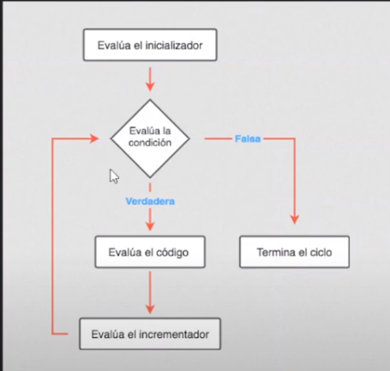

# Ciclos

Tambien se le llaman bucles o iterraciones. Volver a repetir un trozo de codigo. 


[link de la referencia](https://youtu.be/aCbLJO8HIzk?t=200)

# ciclos por conteo
"for" (un numero de veces especificas)

# ciclos por condicionales
Se repite mientras la condición que se esta evaluando es verdadera. La estructura es "while" y "do while"

# For

"desde" zona donde se estableces valores iniciales de las variables que controlan el ciclo. 

El "hasta" es el único elemento que decide si se repite o se detiene el ciclo.

La "actualización" es el nuevo valor que se asigna después de cada repetición a las variables que controlan la repetición.

```javascript
for(desde; hasta; actualización) {
 … //lo que se escriba acá se ejecutará mientras dure el ciclo
}
```
El siguiente ejemplo se utiliza for para contar de 0 a 9.
```javascript
for (let i = 0; i < 10; i++) {
    alert(i);
}
```
```javascript
// Ciclo por conteo - FOR
for(let i=1; i<=3;i++){ // i++ es para sumar 1 de a 1
    // i es la variable contadora
    console.log("Valor de i="+i);
}

console.log("Fin del ciclo for");
```
```javascript
// Diapo 11 - ejemplo practico de la tabla de multiplicar de x numero ingresado por el usuario

// Solicitamos un valor al usuario
let Numero = parseInt(prompt("Ingresar Numero"));
// En cada repetición, calculamos el número ingresado x el número de repetición (i)
for (let i = 1; i <= 10; i++) {
    let resultado = Numero * i ;//2*1=2
    console.log(Numero +" X "+ i +" = "+ resultado);
}
```
```javascript
//Algoritmo para dar turno del 1 al 5 a los nombres asignados

for (let i = 1; i <= 5; i++) {
    // En cada repetición solicitamos un nombre.
    let Nombre = prompt("Ingresar nombre");
    // Informamos el turno asignado usando el número de repetición (i).
    console.log(" Turno  N° "+i+" Nombre: "+Nombre);
}
console.log("No hay mas turnos disponibles para hoy");
```
```javascript
//Ejemplo 1 por la guia de actividades:Pedir número mediante prompt y sumarle otro número en cada repetición,realizando una salida por cada resultado

let numero1 = parseInt(prompt("Ingrese el numero que sera sumado que cada interacción"));
let suma = 0;
for(let i=0; i<10; i++){
    let numero2 = parseInt(prompt("Ingrese el numero para sumar"));
    suma = numero1 + numero2;
    console.log(suma);
}
```

# Sentencia Break

A veces, cuando escribimos una estructura for, necesitamos que bajo cierta condición el ciclo se interrumpa. Para eso se utiliza la sentencia break.
Al escribir esa línea dentro de un ciclo for, el mismo se interrumpirá como si hubiera finalizado.

```javascript
for (let i = 1; i <= 10; i++) {
    //Si la variable i es igual 5 interrumpo el for. 
    if(i == 5){
        break;
    }
    alert(i);
}
```
```javascript
//Proceso de pedido de usuario y contraseña
let user;
let pass;
fallidos = 0;
for(let i=1; i<=3; i++){
    user = prompt("Ingrese nombre de usuario");
    pass = prompt("Ingrese contraseña");
    if((user=="pepe") && (pass=="1234")){
        alert("Bienvenido Pepe!!");
        break; //aqui se utilizo el break porque si la ingreso bien para que preguntarle más veces
    }else{
        fallidos = fallidos + 1;
        alert("Usuario y/o contraseña invalido");
    }
}

if(fallidos == 3){
    alert("El sistema se bloqueo",)
}
```

# Sentencia continue
A veces, cuando escribimos una estructura for, necesitamos que bajo cierta condición, el ciclo saltee esa repetición y siga con la próxima. Para eso se utiliza la sentencia continue. (NO ES TAN COMÚN)

```javascript
for (let i = 1; i <= 10; i++) {
    //Si la variable i es 5, no se interpreta la repetición
    if(i == 5){
        continue;
    }
    alert(i);
}
```
# While
El funcionamiento del bucle while se resume en: mientras se cumpla la condición indicada, repite las instrucciones incluidas dentro del bucle. Se asume que en algún momento la la repetición va a finalziar, si la comparación no se realiza bien se genera un bucle infinito. 

Ejemplo:

```javascript
let entrada = prompt("Ingrese un dato, escriba "ESC" para salir");
//repetimos hasta que el usuario ingresa "ESC"
while (entrada != "ESC"){
    alert("El usuario ingresó " + entrada);
    //Volvemos a solicitar un dato. En la proxima se evaluar si no es ESC
    entrada = prompt("Ingresar otro dato");
}


```

```javascript
// Ciclos por condición WHILE

let edad = prompt("Ingrese su edad (0-para salir)");
// si yo ingreso el 0 nunca entramos al while
while (edad != "0"){
    if(edad < 20){
        alert("Eres un niño o adolescente");
    }else if(edad<60){
        alert("Eres un adulto con experiencia");
    }else{
        alert("Que bien estas!");
    }

    edad = prompt("Ingrese su edad (0-para salir");
}
```

# DO WHILE
La estructura do...while permite crear bucles que se ejecutan una o más veces, dependiendo de la condición indicada.
A diferencia de while, garantiza que el bloque de código se interpreta al menos una vez, porque la condición se evalúa al final.

Ejemplo: Algoritmo que solicita la entrada y se detiene cuando NO es un número. 

```javascript
let numero = 0;
do{
    //Repetimos con do... while mientras el usuario ingresa un n°
    numero = prompt("Ingresas numero");
    console.log(numero);
    //Si el parseo no resulta un número se interumpe el bucle
}while(parseInt(numero));
```
```javascript
// do while | Al menos cicla una vez

let dato = "mesa"
do{
    console.log(dato)
}while(dato != "mesa");

```
## Buen ejemplo para notar las diferencia de while y do while:

```javascript
// while
let x = 10;
while (x < 10){
    console.log("Ciclo while numero " + x)
    x++;
}


// do...while
let z = 10; 
do {
    console.log("Ciclo do... while numero " + z);
    z++;
}   while (z<10)
```
Nota: Se puede cambiar el valor de la variable y su limite para ir jugando y entendiendo. 
# Switch
No es un ciclo. Cuando tengo mucho para evaluar. En vez de poner el if, if else y else. Es una estructura más amigable. Es un CONDICIONAL. 
Nota: Si no se pone el break se ejecuta todo... Puede haber situacioens que cuando se cumpla una condición tambien se cumplan otras...

Ejemplo: 

```javascript
let id = prompt("Ingresa el codigo del producto, 0-para salir");


while(id != "0"){
switch(id){
    case "1":
        alert("Mouse marca Logitech U$D 30");
        break;
    case "2":
        alert("Teclado wireless marca Genius U$D 88");
        break;
    case "3":
        alert("Monitor...");
        break;
        default:
            alert("Codigo inexistente");
            break;
    }
    id = prompt("Ingresa el codigo del prodcuto 0-para salir")
}
```
## Ejemplo para observar codigo de SWITCH e IF que hace lo mismo:

```javascript
// Switch

let x = 2;

switch (x){
    case 0:
        console.log("SWITCH X vale 0");
        break;
    case 1:
        console.log("SWITCH X vale 1");
        break;
    case 2:
        console.log("SWITCH X vale 2");
        break;
    default:
        console.log("SWITCH X no vale 0, 1 ni 2");
} //este codigo con switch

if (x==0){
console.log("IF X vale 0");
}else if(x==1){
    console.log("IF X vale 1");
}else if(x==2){
    console.log("IF X vale 2");
}else{
    console.log("IF X no vale 0, 1 ni 2")
} //hace lo mismo que este codigo con IF
```
### Otro ejemplo

```javascript
let diadelasemana = parseInt(prompt("Ingrese dia de la semana con números"));

switch (diadelasemana){
    case 1:
        console.log("Lunes");
        break;
    case 2:
        console.log("Martes");
        break;
    case 3:
        console.log("Miercoles");
        break;
    case 4:
        console.log("Jueves");
        break;
    case 5:
        console.log("Viernes");
        break;
    case 6:
        console.log("Sabado");
        break;
    case 7:
        console.log("Domingo");
        break;
    default:
        console.log("No equivale a ningun dia de la semana");
}
```